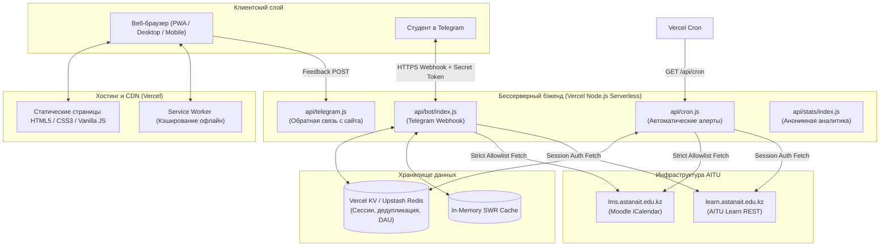

# 🎓 GradeMaster

[](package.json)
[](#)
[](https://t.me/aitugrademaster_bot)
[](#)

> **GradeMaster** — современная академическая экосистема для студентов **Astana IT University (AITU)**. Включает адаптивное веб-приложение (PWA) и многофункционального Telegram-бота для точного расчёта баллов, прогнозирования стипендии, контроля посещаемости и интеллектуального мониторинга дедлайнов Moodle LMS и AITU Learn.

---

## 📑 Содержание

1. [Возможности веб-платформы](#-возможности-веб-платформы)
2. [Telegram-бот (@aitugrademaster_bot)](#-telegram-бот-aitugrademaster_bot)
3. [Академические правила и регламент AITU](#-академические-правила-и-регламент-aitu)
4. [Архитектура и стек технологий](#-архитектура-и-стек-технологий)
5. [Безопасность и приватность](#-безопасность-и-приватность)
6. [Структура проекта](#-структура-проекта)
7. [Быстрый старт и запуск](#-быстрый-старт-и-запуск)
8. [Переменные окружения (.env)](#-переменные-окружения-env)
9. [Тестирование и проверка качества](#-тестирование-и-проверка-качества)
10. [Локализация](#-локализация)

---

## 🚀 Возможности веб-платформы

Веб-приложение GradeMaster работает как быстрый, легковесный Single Page / Multi-Page ресурс без тяжелых фреймворков и доступно на любом устройстве.

### 🎯 1. Калькулятор итоговой оценки (`TotalCalculator.html`)

- **Формула AITU:** $\text{Total} = (\text{RegMid} \times 0.3) + (\text{RegEnd} \times 0.3) + (\text{Final} \times 0.4)$ (или $\text{RegTerm} \times 0.6 + \text{Final} \times 0.4$).
- **Режим прогноза:** если экзамен ещё не сдан, рассчитывает минимальный балл за файнал для:
  - Сдачи дисциплины ($\ge 50.00$);
  - Обычной стипендии ($\ge 70.00$);
  - Повышенной стипендии ($\ge 90.00$).
- **Проверка допусков:** контролирует минимальный порог РегМида ($\ge 25$), РегЭнда ($\ge 25$) и РегТерма ($\ge 50.00$).
- **3 режима отображения:** *Стандартный*, *Серьёзный* и *Злой (Evil Mode)* с ироничными студенческими комментариями.
- **Stateless URL-Sharing:** возможность поделиться своим расчётом через URL (параметры сжаты в безопасный URL-safe Base64, данные не хранятся на сервере).

### 📊 2. Калькулятор GPA триместра (`CalculatorGPA.html`)

- Подсчёт средневзвешенного GPA за семестр/триместр по кредитам предметов (ECTS).
- Поддержка ввода как числовых баллов (0–100%), так и буквенных оценок (`A`, `A-`, `B+`, `B`, `B-`, `C+`, `C`, `C-`, `D+`, `D`, `FX`, `F`).
- Автоматический перевод в 4.00-балльную американскую шкалу и шкалу ECTS.

### 📈 3. Кумулятивный GPA за несколько триместров (`CumulativeGPA.html`)

- Расчёт общего (Cumulative) GPA за всё время обучения в университете.
- Учёт разного количества кредитов в каждом триместре/семестре (до 20 периодов).
- Расчёт кумулятивного балла как общего соотношения Quality Points к сумме кредитов.

### 📋 4. Калькулятор посещаемости (`AttendanceCalculator.html`)

- **Регламент 10 недель:** расчёт строго под 10-недельный триместр AITU.
- **Лимит 30%:** автоматический расчёт предельно допустимого количества пропусков.
- **Учёт пар:** 1 занятие = 50 мин (1 академический час). Сдвоенная пара (100 мин) считается как 2 занятия.
- **Визуальный индикатор риска:**
  - 🟢 *Безопасная зона* (запас пропусков комфортный);
  - 🟡 *Зона внимания* (остался 1 пропуск или порог близок);
  - 🔴 *Критический статус* (превышение лимита $\rightarrow$ недопуск к экзамену / летник).

### 📚 5. Предметные шаблоны (`templated_calculator.html`)

- Готовые предустановленные веса и структуры оценивания для распространённых дисциплин AITU.
- Ускоренный ввод компонентов без ручной настройки процентов.

### 💬 6. Форма обратной связи (`Feedback.html`)

- Прямая связь с разработчиками через серверную функцию `api/telegram.js`.
- Защита от спама, клиентская валидация и подтверждение доставки тикета.

### 📱 7. PWA и интерфейс

- Полная поддержка **Progressive Web App (PWA)**: установка иконки на рабочий стол iOS/Android, работа офлайн через Service Worker (`sw.js`).
- Поддержка переключения **Тёмной / Светлой темы** с сохранением выбора.
- Горячие клавиши, фокус-навигация для скринридеров и Dev HUD (пасхалка по Konami Code `↑ ↑ ↓ ↓ ← → ← → B A`).

---

## 🤖 Telegram-бот (`@aitugrademaster_bot`)

Бот написан на Node.js и развёрнут на Serverless-инфраструктуре Vercel. Является полноценным персональным академическим ассистентом.

### ⚡ Быстрые команды

| Команда | Описание | Пример |
| --- | --- | --- |
| `/calc <rm> <re> [final]` | Расчёт итоговой оценки или прогноз файнала | `/calc 80 85` или `/calc 80 85 90` |
| `/gpa <предметы>` | Расчёт GPA за триместр по строкам | `/gpa 90 3, 85 4, 95 2` или `/gpa A 3, B+ 4` |
| `/cgpa <gpa кр, ...>` | Кумулятивный GPA за несколько триместров | `/cgpa 3.5 18, 3.8 20, 3.2 18` |
| `/att <пар_в_нед> [пропущено]` | Контроль посещаемости и лимита 30% | `/att 3 2` |
| `/convert <балл>` | Конвертер процентов в GPA и букву ECTS | `/convert 87` |
| `/lms` | Список дедлайнов Moodle LMS на текущую неделю | `/lms` |
| `/aitu` или `/quizzes` | Список квизов AITU Learn на текущую неделю | `/quizzes` |
| `/all_deadlines` | Все дедлайны LMS до конца семестра | `/all_deadlines` |
| `/all_quizzes` | Все квизы Learn до конца семестра | `/all_quizzes` |
| `/courses` | Интерактивная фильтрация дедлайнов по дисциплинам | `/courses` |
| `/done` | Меню отметки сданных заданий (убирает их из алертов) | `/done` или `/done all` |
| `/cookie` | Интерактивное руководство по подключению дедлайнов | `/cookie` |
| `/feedback` | Отправка сообщения / отзыва разработчику | `/feedback Неправильно считает предмет X` |
| `/admin` | Панель управления (только для авторизованных админов) | `/admin` |

### 🧠 Распознавание естественного языка (NLP)

Бот оснащён встроенным парсером естественного языка. Студенту необязательно помнить синтаксис команд:

- *«у меня регмид 80 и регенд 70 сколько нужно на стипендию»* $\rightarrow$ бот мгновенно поймёт запрос и выдаст прогноз.
- *«при 85 90 какой файнал нужен»* $\rightarrow$ автоматический расчёт требуемого балла.
- Вставка ссылки календаря Moodle LMS напрямую в чат $\rightarrow$ автоматическое безопасное подключение без ввода `/set_lms`.

### 🔔 Интеллектуальный Cron-мониторинг (`api/cron.js`)

- **08:00 (утро Астаны)** — ежедневная утренняя сводка квизов и дедлайнов на ближайшие 3 дня.
- **20:00 (вечер Астаны)** — вечерний чек-лист дедлайнов на сегодня и завтра.
- **🚨 Экстренный алерт за 1 час** — громкое оповещение с сиреной, точным временем и инлайн-кнопкой перехода прямо к сдаче задания.
- **Дедупликация:** хранение истории отправленных алертов предотвращает повторный спам.
- **Изоляция:** каждый студент получает уведомления строго по своим личным предметам и подпискам.

### 🛡 Панель администратора

- Просмотр DAU (Daily Active Users) и распределения типов расчётов.
- Массовые объявления (`/broadcast <текст>`) с поддержкой безопасного форматирования HTML и автоматической очисткой заблокировавших бота пользователей.
- Ответ студенту свайпом (Reply) на уведомление тикета прямо из чата Telegram без необходимости вручную писать ID.

---

## 📐 Академические правила и регламент AITU

| Параметр | Порог / Правило | Последствие невыполнения |
| --- | --- | --- |
| **РегМид / РегЭнд** | $\ge 25.00$ баллов | Если $< 25$ — автоматический недопуск к экзамену, **Летник (F)** |
| **РегТерм** | $\ge 50.00$ баллов | Если $< 50$ — автоматический недопуск к экзамену, **Летник (F)** |
| **Файнал (Экзамен)** | $\ge 50.00$ баллов | Если $< 25$ — **Летник (F)** без права пересдачи |
| **Пересдача (FX)** | $\text{Final} \in [25, 49]$ при $\text{Total} \ge 50$ | Студенту предоставляется одна попытка пересдачи экзамена (Retake) |
| **Итоговый балл (Total)** | $\ge 50.00$ баллов | Если $\text{Total} < 50.00$ — **Летник (F)** |
| **Обычная стипендия** | $\text{Total} \ge 70.00$ баллов | По всем предметам семестра должно быть $\ge 70$ (оценки A, A-, B+, B, B-) |
| **Повышенная стипендия** | $\text{Total} \ge 90.00$ баллов | Все оценки только отличные (A, A-) |
| **Лимит пропусков** | $\le 30\%$ от общего числа занятий | При превышении $30\%$ — недопуск к экзамену независимо от баллов |

---

## 🏗 Архитектура и стек технологий



- **Frontend:** чистый Vanilla JavaScript (ES6+), современный адаптивный CSS3 с CSS-переменными, семантический HTML5. Никаких тяжёлых фреймворков — моментальная загрузка.
- **Backend:** Node.js (Vercel Serverless Functions).
- **База данных / Кэш:** Vercel KV (Redis) с многоуровневым In-Memory fallback (SWR-кэширование).
- **Тестирование:** встроенный раннер `node:test`, LinkeDOM для тестирования браузерных страниц без запуска тяжелого браузера.

---

## 🔒 Безопасность и приватность

Проект спроектирован с соблюдением стандартов безопасной разработки (DevSecOps):

1. **SSRF-защита (Server-Side Request Forgery):**
   - Строгий allowlist: внешние запросы календаря разрешены **только** на официальный домен `lms.astanait.edu.kz`.
   - Любые сторонние хосты, URL с учётными данными (`user:pass@host`), нестандартные порты и локальные адреса немедленно блокируются до выполнения `fetch`.
2. **Аутентификация вебхуков:**
   - Вебхук Telegram проверяет секретный токен через заголовок `X-Telegram-Bot-Api-Secret-Token`. Запросы без валидного секрета отсекаются со статусом `401 Unauthorized`.
3. **Безопасность сессий и токенов:**
   - Валидация формата `sessionid` и кук по строгому regex-шаблону перед отправкой во внутренние запросы.
   - Использование постоянных iCal-токенов вместо долгосрочного хранения паролей студентов.
4. **Конфиденциальность (GDPR / Privacy-friendly):**
   - Аналитика не сохраняет сырые идентификаторы пользователей (`chat.id` / `user.id`).
   - Идентификаторы необратимо псевдонимизируются через `HMAC-SHA-256` с солью окружения.
5. **Заголовки безопасности:**
   - В [vercel.json](vercel.json) настроены `Content-Security-Policy`, `X-Frame-Options: DENY`, `X-Content-Type-Options: nosniff`, `Referrer-Policy: strict-origin-when-cross-origin`.
6. **Право на забвение (Right-to-Erasure):**
   - Команды `/del_lms` и `/logout` полностью стирают сохранённые данные сессии из базы данных и памяти.

---

## 📁 Структура проекта

```text
GradeMaster/
├── index.html                   # Главная страница-навигатор по калькуляторам
├── manifest.json                # PWA-манифест
├── sw.js                        # Service Worker для кэширования и офлайн-режима
├── vercel.json                  # Конфигурация заголовков, Cron-расписания и роутов Vercel
├── package.json                 # Скрипты запуска тестов и зависимости
│
├── main/                        # Страницы калькуляторов
│   ├── TotalCalculator.html     # Калькулятор итоговой оценки и стипендии
│   ├── CalculatorGPA.html       # Калькулятор GPA за триместр
│   ├── CumulativeGPA.html       # Калькулятор кумулятивного GPA
│   ├── AttendanceCalculator.html# Калькулятор посещаемости (лимит 30%)
│   ├── templated_calculator.html# Шаблоны популярных предметов
│   └── Feedback.html            # Форма обратной связи
│
├── js/                          # Клиентская логика
│   ├── total.js                 # Логика итоговой оценки и Base64-шаринга
│   ├── gpa.js                   # Логика GPA триместра
│   ├── cumulative.js            # Логика кумулятивного GPA
│   ├── att.js                   # Логика посещаемости
│   ├── language.js              # Словари переводов (RU / KK / EN)
│   ├── localization.js          # Контроллер языка и темной/светлой темы
│   └── feedback.js              # Отправка формы обратной связи
│
├── style/                       # Стили интерфейса
│   ├── style.css                # Основные стили и дизайн-система
│   ├── navbarResponsive.css     # Адаптивная навигация
│   └── modernTotal.css          # Стили TotalCalculator
│
├── api/                         # Серверные функции (Vercel Serverless)
│   ├── telegram.js              # Обработка заявок обратной связи с сайта
│   ├── cron.js                  # Фоновые проверки дедлайнов и рассылка оповещений
│   ├── bot/                     # Модуль Telegram-бота
│   │   ├── index.js             # Главный контроллер вебхука, калькуляторов и команд
│   │   ├── lms.js               # Интеграция с Moodle LMS (парсер iCalendar)
│   │   ├── aitu.js              # Интеграция с AITU Learn (парсер квизов)
│   │   └── README.md            # Подробный гайд по развертыванию бота
│   └── stats/                   # Модуль анонимной аналитики
│       ├── index.js             # Endpoint телеметрии
│       └── engine.js            # Движок подсчета DAU и посещений
│
└── tests/                       # Автоматические тесты (105+ тестов)
    ├── project.test.cjs         # Основной тестовый набор (DOM, API, бот, расчеты)
    └── security.test.cjs        # Тесты безопасности (SSRF, инъекции, токены)
```

---

## 💻 Быстрый старт и запуск

### Запуск веб-сайта локально

Для запуска статических страниц не требуется сборка или компиляция. Достаточно запустить любой локальный веб-сервер в корне проекта:

**Вариант 1 (Node.js):**

```bash
npx serve .
```

**Вариант 2 (Python 3):**

```bash
python -m http.server 8080
```

Сайт откроется по адресу `http://localhost:8080`.

> **Примечание:** Для работы формы обратной связи на локальном сервере требуется запуск бессерверных функций через [Vercel CLI](https://vercel.com/docs/cli):
>
> ```bash
> npx vercel dev
> ```

---

## ⚙️ Переменные окружения (.env)

Для полноценной работы Telegram-бота и фоновых Cron-напоминаний настройте переменные окружения в панели Vercel или в локальном файле `.env`:

```ini
# Токен бота от @BotFather (обязательно)
TELEGRAM_BOT_TOKEN="1234567890:ABCdefGHIjklMNOpqrsTUVwxyz"

# Секретный токен для верификации вебхука Telegram (рекомендуется)
TELEGRAM_SECRET_TOKEN="your_random_secret_token_min_32_chars"

# Telegram ID администратора(ов) через запятую (для оповещений и команды /admin)
ADMIN_CHAT_ID="123456789,987654321"

# Секретный ключ для авторизации cron-запросов (защита /api/cron)
CRON_SECRET="your_cron_secret_key"

# Vercel KV / Upstash Redis (для постоянного хранения сессий и аналитики)
KV_REST_API_URL="https://your-kv-instance.upstash.io"
KV_REST_API_TOKEN="your_kv_rest_token"

# Секретная соль для псевдонимизации аналитики (любая случайная строка)
ANALYTICS_SALT="super_secret_analytics_salt_key"
```

---

## 🧪 Тестирование и проверка качества

Тестовый набор покрывает всю бизнес-логику калькуляторов, безопасность эндпоинтов, парсинг данных и маршрутизацию сообщений бота.

Для запуска тестов используется нативный раннер Node.js (рекомендуется Node.js 20+):

```bash
# Установка dev-зависимостей (LinkeDOM для эмуляции DOM)
npm ci

# Запуск полного набора из 105+ тестов
npm test
```

### Что проверяется в тестах

- Корректность формул всех калькуляторов (Total, GPA, Cumulative, Attendance, Convert);
- Граничные условия академических правил AITU (допуски, пересдачи FX, пороги 25/50 баллов, 30% лимит посещаемости);
- Защита от SSRF при передаче сторонних ссылок календаря;
- Верификация секретного токена вебхука и отсечение неавторизованных запросов;
- Парсинг iCalendar (RFC 5545) и корректная фильтрация событий семестра;
- Дедупликация и отправка экстренных оповещений Cron за 1 час до дедлайна;
- Доступность, корректность ссылок в HTML и валидность PWA-манифеста.

---

## 🌍 Локализация

Интерфейс GradeMaster полностью переведён на три языка:

- 🇷🇺 **Русский** (по умолчанию)
- 🇰🇿 **Қазақша**
- 🇬🇧 **English**

Словари переводов находятся в файле [`js/language.js`](js/language.js), а логика переключения и сохранения предпочтений пользователя — в [`js/localization.js`](js/localization.js).

Для добавления новой текстовой константы:

1. Добавьте ключ в словарь каждого из трёх языков (`ru`, `kk`, `en`) в `js/language.js`.
2. Используйте атрибут `data-translate="your_key"` в HTML-разметке или функцию `getTranslation('your_key')` в JavaScript.

---

## 👥 Авторы и обратная связь

- **Разработчик:** Not_404 ([@Qrudos](https://t.me/Qrudos))
- **Telegram Bot:** [@aitugrademaster_bot](https://t.me/aitugrademaster_bot)
- Если вы обнаружили ошибку или у вас есть предложение по улучшению, напишите через форму обратной связи на сайте или отправьте команду `/feedback` в боте.

---

<div align="center">
  <sub>Сделано с ❤️ для студентов Astana IT University</sub>
</div>
