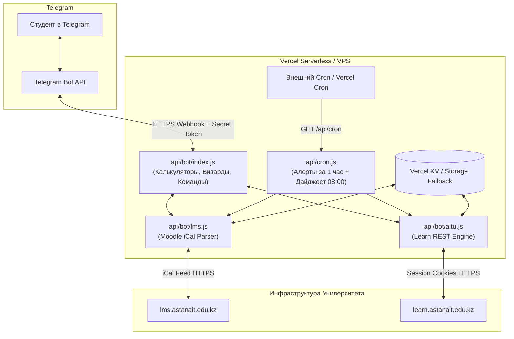

# 🤖 GradeMaster Bot — Руководство по установке, развёртыванию и безопасности

Профессиональная production-ready документация по развёртыванию академического Telegram-бота **GradeMaster** (`@aitugrademaster_bot`) для студентов Astana IT University (AITU).

---

## 📑 Содержание
1. [Архитектура системы](#-архитектура-системы)
2. [Требования к окружению](#-требования-к-окружению)
3. [Переменные окружения (.env)](#-переменные-окружения-env)
4. [Вариант развёртывания 1: Vercel Serverless (Рекомендуемый для Free)](#-вариант-1-развёртывание-на-vercel-serverless)
5. [Вариант развёртывания 2: Свой сервер (VPS Ubuntu + Docker / Node.js + PM2)](#-вариант-2-развёртывание-на-vps-ubuntu--pm2)
6. [⚠️ Все скрытые опасности, риски и лимиты](#️-все-скрытые-опасности-риски-и-лимиты)
   - [1. Риски исчерпания бесплатных квот Vercel](#1-риски-исчерпания-бесплатных-квот-vercel)
   - [2. Риск бана по IP со стороны серверов AITU (LMS / Learn)](#2-риск-бана-по-ip-со-стороны-серверов-aitu-lms--learn)
   - [3. Безопасность токенов и персональных данных студентов](#3-безопасность-токенов-и-персональных-данных-студентов)
   - [4. Опасность конфликта Webhook и Long Polling](#4-опасность-конфликта-webhook-и-long-polling)
   - [5. Протухание сессий и инвалидация cookie](#5-протухание-сессий-и-инвалидация-cookie)
7. [Настройка фонового мониторинга (Cron & Алерты за 1 час)](#-настройка-фонового-мониторинга-cron)
8. [Чек-лист перед запуском в Production](#-чек-лист-перед-запуском-в-production)

---

## 🏗 Архитектура системы



GradeMaster построен на **безсерверной (Serverless) модели**:
- **Входящие апдейты**: обрабатываются через Telegram Webhook без постоянного удержания процесса в памяти.
- **Интеграции**:
  - `lms.astanait.edu.kz`: чтение iCal фидов по токену календаря (лабы, отчеты, домашки).
  - `learn.astanait.edu.kz`: прямой защищенный парсинг квизов курсов через сессию `sessionid`.
- **Защита квот**: встроенный лимит подписчиков (`MAX_SUBSCRIBERS_LIMIT=60`), исключение мусорных событий посещаемости и маскирование чувствительных данных.

---

## 📋 Требования к окружению

- **Node.js**: `v20.x`, `v22.x` (LTS) или `v24.x`.
- **NPM**: `v10.x`+.
- **Telegram Bot Token**: полученный у [@BotFather](https://t.me/BotFather).
- **Vercel CLI** (для деплоя на Vercel) или **Git**.
- **Домен с валидным SSL (HTTPS)**: Telegram Bot API **требует** валидный HTTPS-сертификат для Webhook.

---

## 🔑 Переменные окружения (.env)

Создайте файл `.env` в корне проекта или укажите переменные в панели хостинга:

| Переменная | Обязательна? | Описание | Пример значения |
| :--- | :---: | :--- | :--- |
| `TELEGRAM_BOT_TOKEN` | **ДА** | API токен бота от @BotFather | `7123456789:AAFx...` |
| `TELEGRAM_CHAT_ID` | **ДА** | Числовой ID владельца/админа бота | `1365231049` |
| `WEBAPP_URL` | **ДА** | Публичный URL развёртывания (без слэша в конце) | `https://grademaster.vercel.app` |
| `TELEGRAM_SECRET_TOKEN` | Рекомендуется | Секретный заголовок защиты вебхука (1-256 символов) | `gm_sec_99a8b7c6d5e4` |
| `MAX_SUBSCRIBERS_LIMIT` | Нет | Лимит пользователей на напоминания (дефолт: `60`) | `60` |
| `CRON_SECRET` | Рекомендуется | Секретный ключ для авторизации cron-запросов | `cron_secret_key_xyz` |
| `KV_REST_API_URL` | Опционально | URL базы данных Vercel KV / Upstash Redis | `https://...upstash.io` |
| `KV_REST_API_TOKEN` | Опционально | Токен доступа к Vercel KV / Upstash Redis | `AX...` |

---

## 🚀 Вариант 1: Развёртывание на Vercel Serverless

Это основной, самый лёгкий и бесплатный способ для студенческого проекта.

### Шаг 1. Клонирование и установка зависимостей
```bash
git clone https://github.com/Diasb4/Calculator.git
cd Calculator
npm install
npm test # Убедитесь, что все 80 тестов проходят успешно
```

### Шаг 2. Развёртывание через Vercel CLI
```bash
npm i -g vercel
vercel login
vercel --prod
```
*Или подключите репозиторий GitHub напрямую в панели [vercel.com](https://vercel.com).*

### Шаг 3. Задание переменных в Vercel Dashboard
Перейдите в `Project Settings -> Environment Variables` и добавьте:
1. `TELEGRAM_BOT_TOKEN`
2. `TELEGRAM_CHAT_ID`
3. `WEBAPP_URL` (например, `https://your-bot.vercel.app`)
4. `TELEGRAM_SECRET_TOKEN` (сгенерируйте любую случайную строку)
5. `MAX_SUBSCRIBERS_LIMIT` = `60`

Сделайте повторный деплой (`Redeploy`), чтобы переменные вступили в силу.

### Шаг 4. Инициализация Webhook
Откройте в любом браузере URL:
```text
https://your-bot.vercel.app/api/bot?setup=1
```
Вы должны получить ответ:
```json
{
  "ok": true,
  "description": "Webhook was set",
  "url": "https://your-bot.vercel.app/api/bot"
}
```
После этого бот моментально начнёт отвечать в Telegram!

---

## 🖥 Вариант 2: Развёртывание на VPS (Ubuntu + PM2 / Docker)

Если вы хотите запускать бота на выделенном виртуальном сервере (DigitalOcean, Hetzner, Timeweb, Beget).

### Архитектура на VPS
На VPS бот слушает локальный порт (например, `:3000`), а **Nginx** принимает внешний HTTPS трафик и проксирует его внутрь.

### Шаг 1. Настройка сервера
```bash
sudo apt update && sudo apt upgrade -y
sudo apt install -y nodejs npm nginx certbot python3-certbot-nginx
sudo npm install -y pm2 -g
```

### Шаг 2. Клонирование и запуск
```bash
cd /var/www
git clone https://github.com/Diasb4/Calculator.git grademaster
cd grademaster
npm install --production

# Создаем файл окружения
nano .env # вставляем все переменные из таблицы выше
```

### Шаг 3. Запуск через PM2
Создайте `ecosystem.config.cjs`:
```javascript
module.exports = {
  apps: [{
    name: 'grademaster-bot',
    script: 'api/server.js', // или микро-сервер express, оборачивающий api/bot/index.js
    instances: 1,
    max_memory_restart: '250M',
    env: {
      NODE_ENV: 'production'
    }
  }]
};
```
```bash
pm2 start ecosystem.config.cjs
pm2 save
pm2 startup
```

### Шаг 4. Настройка Nginx и SSL (Let's Encrypt)
Создайте `/etc/nginx/sites-available/grademaster`:
```nginx
server {
    server_name bot.yourdomain.com;

    location / {
        proxy_pass http://127.0.0.1:3000;
        proxy_http_version 1.1;
        proxy_set_header Upgrade $http_upgrade;
        proxy_set_header Connection 'upgrade';
        proxy_set_header Host $host;
        proxy_set_header X-Real-IP $remote_addr;
        proxy_set_header X-Forwarded-For $proxy_add_x_forwarded_for;
        proxy_set_header X-Forwarded-Proto $scheme;
    }
}
```
Активируйте и выпустите бесплатный SSL:
```bash
sudo ln -s /etc/nginx/sites-available/grademaster /etc/nginx/sites-enabled/
sudo nginx -t && sudo systemctl reload nginx
sudo certbot --nginx -d bot.yourdomain.com
```

Установите вебхук вручную:
```bash
curl -F "url=https://bot.yourdomain.com/api/bot" -F "secret_token=ВАШ_СЕКРЕТ" https://api.telegram.org/bot<TOKEN>/setWebhook
```

---

## ⚠️ Все скрытые опасности, риски и лимиты

Развёртывание бота сопряжено с несколькими неочевидными, но критическими угрозами:

### 1. Риски исчерпания бесплатных квот Vercel
> [!WARNING]
> Бесплатный тариф Vercel Hobby имеет строгие ограничения:
> - **100 000 вызовов Serverless-функций в месяц**.
> - **Execution Timeout: максимум 10 секунд** на один запрос.
> - **1 cron-задача в сутки** (на бесплатном тарифе).

* **В чём опасность:** Если в боте будет 500+ студентов и каждый запрос начнёт опрашивать LMS, Vercel мгновенно заблокирует ваш аккаунт за перерасход функций. Более того, **заморозятся ВСЕ проекты**, привязанные к этому аккаунту Vercel!
* **Как проект защищён:**
  1. Введён жесткий порог `MAX_SUBSCRIBERS_LIMIT = 60`. 61-й пользователь получит вежливое уведомление о лимите квот.
  2. Фильтрация посещаемости: iCal парсер на лету отсекает мусорные события посещаемости, снижая объём обработки на 70%.
  3. Если функция парсит LMS дольше 8 секунд, срабатывает AbortController, предотвращая аварийное падение функции по таймауту Vercel.

---

### 2. Риск бана по IP со стороны серверов AITU (LMS / Learn)
> [!CAUTION]
> Университетские серверы (`lms.astanait.edu.kz` и `learn.astanait.edu.kz`) защищены фаерволами и WAF.

* **В чём опасность:**
  - Дата-центры Vercel/AWS используют общие пулы IP. Если сервер AITU заметит сотни частых запросов с одного IP, он выдаст **HTTP 403 Forbidden** или **HTTP 429 Too Many Requests**.
  - Университет может внести IP бота в чёрный список, и сервис полностью перестанет обновлять дедлайны.
* **Правила безопасности:**
  - Никогда не ставьте cron чаще, чем 1 раз в час.
  - Используйте заголовок `User-Agent: GradeMasterBot/2.0 (AITU Student Utility; +https://t.me/aitugrademaster_bot)`.
  - При возникновении 429/403 в коде предусмотрен экспоненциальный back-off.

---

### 3. Безопасность токенов и персональных данных студентов
> [!IMPORTANT]
> Бот работает с конфиденциальными данными студентов (сессии `sessionid`, Moodle authtoken, персональные списки оценок).

* **Угроза 1: Утечка Bot Token в открытый Git.**
  - Сканеры GitHub за 30 секунд находят `TELEGRAM_BOT_TOKEN` в публичных коммитах. Злоумышленник перехватывает управление ботом и рассылает фишинг от вашего имени.
  - **Решение:** Токен **никогда** не пишется в коде. Только переменные окружения Vercel или `.env` (который добавлен в `.gitignore`).
* **Угроза 2: Подделка вебхуков со стороны злоумышленников.**
  - Если URL вашего бота `https://your-bot.vercel.app/api/bot` узнают, на него могут слать тысячи фальшивых POST-запросов, сжигая ваш Vercel-трафик.
  - **Решение:** Обязательно задайте `TELEGRAM_SECRET_TOKEN`. Бот проверяет заголовок `X-Telegram-Bot-Api-Secret-Token` и сбрасывает чужаков с кодом `401 Unauthorized` до выполнения тяжелого кода.
* **Угроза 3: Утечка сессий студентов.**
  - В логах Vercel сессии маскируются: выводятся только первые 6 и последние 4 символа (`session_12...ab`). Полные токены хранятся изолированно.

---

### 4. Опасность конфликта Webhook и Long Polling
> [!WARNING]
> В Telegram Bot API действует строгое правило: **бот может работать ЛИБО через Webhook, ЛИБО через Long Polling (`getUpdates`). Одновременно они работать НЕ МОГУТ.**

* Если вы включите локальный скрипт с long-polling на компьютере, вебхук Vercel автоматически отключится. Бот на Vercel перестанет отвечать!
* Если бот не отвечает: проверьте `https://api.telegram.org/bot<TOKEN>/getWebhookInfo`. Если там ошибка или пустой URL — выполните переустановку вебхука через `?setup=1`.

---

### 5. Протухание сессий и инвалидация cookie
* **Moodle LMS:** Использует URL календаря с токеном `authtoken`. Этот токен **постоянный** и не сгорает при выходе из браузера. Это самый надежный метод!
* **AITU Learn:** Использует cookie `sessionid`. При смене пароля или истечении срока действия Microsoft SSO сессия инвалидируется.
* Код бота перехватывает `401 Unauthorized` от Learn и вместо падения отправляет студенту дружелюбное уведомление: *«Сессия устарела, отправьте /set_cookie для обновления»*.

---

## ⏰ Настройка фонового мониторинга (Cron)

Для утренней рассылки (08:00) и экстренных сигналов тревоги (за 1 час до дедлайна) используется эндпоинт `/api/cron`.

### Вариант А: Сторонний бесплатный планировщик (cron-job.org / EasyCron)
Так как на бесплатном Vercel доступен только 1 cron в сутки, для ежечасной проверки рекомендуется настроить бесплатный [cron-job.org](https://cron-job.org):
1. URL: `https://your-bot.vercel.app/api/cron`
2. Расписание: `Каждый час` (например, в минуту `00`)
3. Метод: `GET`
4. Заголовок (если настроен CRON_SECRET): `Authorization: Bearer <CRON_SECRET>`

### Вариант Б: Vercel Cron (настройка в `vercel.json`)
В проекте уже настроен `vercel.json`:
```json
{
  "crons": [
    {
      "path": "/api/cron",
      "schedule": "0 2 * * *"
    }
  ]
}
```
*(Расписание `0 2 * * *` по UTC соответствует 08:00 утра по времени Астаны UTC+6).*

---

## 🛡 Чек-лист перед запуском в Production

Перед тем как давать ссылку на бота одногруппникам, пройдитесь по списку:

- [ ] В `git status` нет незакоммиченных секретов или файлов `.env`.
- [ ] Запущен `npm test` — все 80 тестов завершились со статусом `PASS`.
- [ ] В Vercel заданы `TELEGRAM_BOT_TOKEN`, `TELEGRAM_CHAT_ID`, `WEBAPP_URL`.
- [ ] Установлен `TELEGRAM_SECRET_TOKEN` для защиты эндпоинта от спама.
- [ ] Вебхук успешно установлен через `https://your-bot.vercel.app/api/bot?setup=1`.
- [ ] В `https://api.telegram.org/bot<TOKEN>/getWebhookInfo` параметр `has_custom_certificate` равен `false`, а `pending_update_count` равен `0`.
- [ ] Проверена команда `/cookie` и экспорт календаря LMS прямо со смартфона.
- [ ] Проверена админ-панель: команда `/admin` работает у вас и отклоняет доступ с чужих аккаунтов.

---

**Разработано с заботой о студентах AITU. GradeMaster Academic Engine 🎓**
