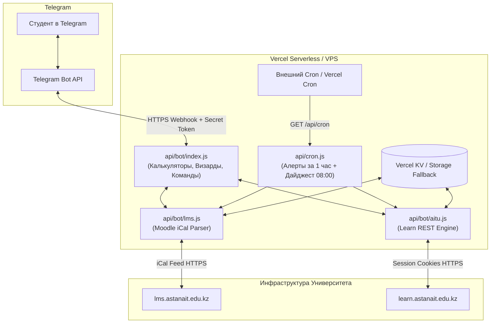

# 🤖 GradeMaster Bot — Руководство по установке, развёртыванию и безопасности

Профессиональная production-ready документация по развёртыванию академического Telegram-бота **GradeMaster** (`@aitugrademaster_bot`) для студентов Astana IT University (AITU).

---

## 📑 Содержание
1. [Архитектура системы](#-архитектура-системы)
2. [Требования к окружению](#-требования-к-окружению)
3. [Переменные окружения (.env)](#-переменные-окружения-env)
4. [Вариант развёртывания 1: Vercel Serverless (Рекомендуемый для Free)](#-вариант-1-развёртывание-на-vercel-serverless)
5. [Вариант развёртывания 2: VPS (Docker Compose, long polling)](#-вариант-2-развёртывание-на-vps-docker-compose-long-polling)
6. [⚠️ Все скрытые опасности, риски и лимиты](#️-все-скрытые-опасности-риски-и-лимиты)
   - [1. Риски исчерпания бесплатных квот Vercel](#1-риски-исчерпания-бесплатных-квот-vercel)
   - [2. Риск бана по IP со стороны серверов AITU (LMS / Learn)](#2-риск-бана-по-ip-со-стороны-серверов-aitu-lms--learn)
   - [3. Безопасность токенов и персональных данных студентов](#3-безопасность-токенов-и-персональных-данных-студентов)
   - [4. Опасность конфликта Webhook и Long Polling](#4-опасность-конфликта-webhook-и-long-polling)
   - [5. Протухание сессий и инвалидация cookie](#5-протухание-сессий-и-инвалидация-cookie)
7. [Настройка фонового мониторинга (Cron & Алерты за 1 час)](#-настройка-фонового-мониторинга-cron)
8. [Чек-лист перед запуском в Production](#-чек-лист-перед-запуском-в-production)

---

## 🏗 Архитектура системы


```mermaid
flowchart TD
    subgraph Telegram
        User[Студент в Telegram] <--> TG_API[Telegram Bot API]
    end

    subgraph Hosting[Vercel Serverless / VPS]
        TG_API <-->|HTTPS Webhook + Secret Token| WebhookHandler["api/bot/index.js\n(Калькуляторы, Визарды, Команды)"]
        CronTrigger[Внешний Cron / Vercel Cron] -->|GET /api/cron| CronService["api/cron.js\n(Алерты за 1 час + Дайджест 08:00)"]
        
        WebhookHandler <--> LMS["api/bot/lms.js\n(Moodle iCal Parser)"]
        WebhookHandler <--> AITU["api/bot/aitu.js\n(Learn REST Engine)"]
        CronService --> LMS
        CronService --> AITU
        
        Storage[("Vercel KV / Storage Fallback")] <--> LMS
        Storage <--> AITU
    end

    subgraph AITU_Infra[Инфраструктура Университета]
        LMS <-->|iCal Feed HTTPS| MoodleLMS[lms.astanait.edu.kz]
        AITU <-->|Session Cookies HTTPS| AituLearn[learn.astanait.edu.kz]
    end
```

GradeMaster построен на **безсерверной (Serverless) модели**:
- **Входящие апдейты**: обрабатываются через Telegram Webhook без постоянного удержания процесса в памяти.
- **Интеграции**:
  - `lms.astanait.edu.kz`: чтение iCal фидов по токену календаря (лабы, отчеты, домашки).
  - `learn.astanait.edu.kz`: прямой защищенный парсинг квизов курсов через сессию `sessionid`.
- **Защита квот**: встроенный лимит подписчиков (`MAX_SUBSCRIBERS_LIMIT=60`), исключение мусорных событий посещаемости и маскирование чувствительных данных.

---

## 📋 Требования к окружению

- **Node.js**: `v20.x`, `v22.x` (LTS) или `v24.x`.
- **NPM**: `v10.x`+.
- **Telegram Bot Token**: полученный у [@BotFather](https://t.me/BotFather).
- **Vercel CLI** (для деплоя на Vercel) или **Git**.
- **Домен с валидным SSL (HTTPS)**: Telegram Bot API **требует** валидный HTTPS-сертификат для Webhook.

---

## 🔑 Переменные окружения (.env)

Создайте файл `.env` в корне проекта или укажите переменные в панели хостинга:

| Переменная | Обязательна? | Описание | Пример значения |
| :--- | :---: | :--- | :--- |
| `TELEGRAM_BOT_TOKEN` | **ДА** | API токен бота от @BotFather | `7123456789:AAFx...` |
| `ADMIN_CHAT_ID` | **ДА** | Числовой ID админа(ов) через запятую | `1365231049` |
| `SESSION_ENC_KEY` | **ДА** (production) | Ключ шифрования сессий студентов, `openssl rand -base64 32` | `q3J...=` |
| `CRON_SECRET` | **ДА** (production) | Bearer-токен для `/api/cron` и `GET /api/stats` | `openssl rand -hex 32` |
| `REDIS_URL` | Один из двух | Redis по TCP (на VPS задан в `docker-compose.yml`) | `redis://redis:6379/0` |
| `KV_REST_API_URL` / `KV_REST_API_TOKEN` | Один из двух | Vercel KV / Upstash Redis REST | `https://...upstash.io` / `AX...` |
| `TELEGRAM_SECRET_TOKEN` | Вебхук | Секрет вебхука, минимум 32 символа (не нужен в режиме polling) | `gm_sec_...` |
| `TELEGRAM_CHAT_ID` | Сайт | Чат для обратной связи с сайта; запасной ID админа | `1365231049` |
| `WEBAPP_URL` | Нет | Публичный URL сайта (без слэша в конце) | `https://grademaster.vercel.app` |
| `BOT_POLLING` / `ENABLE_BACKGROUND_CRON` | Нет | `true` на VPS: long polling и cron каждые 15 минут | `true` |

Полный список — в [.env.example](../../.env.example).

---

## 🚀 Вариант 1: Развёртывание на Vercel Serverless

Это основной, самый лёгкий и бесплатный способ для студенческого проекта.

### Шаг 1. Клонирование и установка зависимостей
```bash
git clone https://github.com/Diasb4/Calculator.git
cd Calculator
npm install
npm test # Убедитесь, что все 80 тестов проходят успешно
```

### Шаг 2. Развёртывание через Vercel CLI
```bash
npm i -g vercel
vercel login
vercel --prod
```
*Или подключите репозиторий GitHub напрямую в панели [vercel.com](https://vercel.com).*

### Шаг 3. Задание переменных в Vercel Dashboard
Перейдите в `Project Settings -> Environment Variables` и добавьте:
1. `TELEGRAM_BOT_TOKEN`
2. `TELEGRAM_CHAT_ID`
3. `WEBAPP_URL` (например, `https://your-bot.vercel.app`)
4. `TELEGRAM_SECRET_TOKEN` (сгенерируйте любую случайную строку)
5. `MAX_SUBSCRIBERS_LIMIT` = `60`

Сделайте повторный деплой (`Redeploy`), чтобы переменные вступили в силу.

### Шаг 4. Инициализация Webhook
Секрет передаётся только заголовком (параметр `?secret=` больше не принимается):
```bash
curl -H "x-telegram-bot-api-secret-token: $TELEGRAM_SECRET_TOKEN" "https://your-bot.vercel.app/api/bot?setup=1"
```
Вы должны получить ответ с `"ok": true` и адресом вебхука. После этого бот начнёт отвечать в Telegram.

> Если бот уже работает на VPS в режиме long polling, не вызывайте `?setup=1`: вебхук перехватит апдейты у VPS.

---

## 🖥 Вариант 2: Развёртывание на VPS (Docker Compose, long polling)

На VPS бот сам забирает апдейты через `getUpdates` (long polling): домен, HTTPS и открытые порты не нужны. Стек `docker-compose.yml` — контейнер бота (`server.js`, без root, read-only, лимиты CPU/памяти) и собственный Redis с AOF-персистентностью. Порты наружу не публикуются: Docker-порты обходят `ufw`, а боту нужен только исходящий трафик.

### Шаг 1. Docker Engine
Установите Docker Engine и плагин compose из официального apt-репозитория Docker (`docker-ce`, `docker-compose-plugin`).

### Шаг 2. Клонирование и `.env`
```bash
git clone https://github.com/Diasb4/Calculator.git /opt/grademaster
cd /opt/grademaster
cp .env.example .env && chmod 600 .env
# TELEGRAM_BOT_TOKEN, ADMIN_CHAT_ID, SESSION_ENC_KEY (openssl rand -base64 32), CRON_SECRET (openssl rand -hex 32)
```

### Шаг 3. Перенос данных (если бот уже работал на Vercel)
```bash
# на машине с доступом к Upstash:
node --env-file=.env scripts/export_kv.js kv_dump.json
# на VPS, файл положить в /opt/grademaster/import/ (владелец uid 1000, права 600):
docker compose up -d redis
docker compose run --rm --no-deps -v /opt/grademaster/import:/import:ro bot node scripts/import_kv.js /import/kv_dump.json
shred -u import/kv_dump.json
```
Импорт шифрует сессии ключом `SESSION_ENC_KEY` и завершится с ошибкой, если хоть одна команда не выполнилась.

### Шаг 4. Запуск
```bash
docker compose up -d --build
docker compose logs -f bot   # «Long polling started (webhook removed)» и раз в 15 минут «⏰ Cron: users=…»
docker compose ps            # оба сервиса healthy
```
При старте бот сам удаляет вебхук. Остановка (`docker compose stop bot`) корректно дожидается обработки текущих апдейтов и прогона cron.

---

## ⚠️ Все скрытые опасности, риски и лимиты

Развёртывание бота сопряжено с несколькими неочевидными, но критическими угрозами:

### 1. Риски исчерпания бесплатных квот Vercel
> [!WARNING]
> Бесплатный тариф Vercel Hobby имеет строгие ограничения:
> - **100 000 вызовов Serverless-функций в месяц**.
> - **Execution Timeout: максимум 10 секунд** на один запрос.
> - **1 cron-задача в сутки** (на бесплатном тарифе).

* **В чём опасность:** Если в боте будет 500+ студентов и каждый запрос начнёт опрашивать LMS, Vercel мгновенно заблокирует ваш аккаунт за перерасход функций. Более того, **заморозятся ВСЕ проекты**, привязанные к этому аккаунту Vercel!
* **Как проект защищён:**
  1. Введён жесткий порог `MAX_SUBSCRIBERS_LIMIT = 60`. 61-й пользователь получит вежливое уведомление о лимите квот.
  2. Фильтрация посещаемости: iCal парсер на лету отсекает мусорные события посещаемости, снижая объём обработки на 70%.
  3. Если функция парсит LMS дольше 8 секунд, срабатывает AbortController, предотвращая аварийное падение функции по таймауту Vercel.

---

### 2. Риск бана по IP со стороны серверов AITU (LMS / Learn)
> [!CAUTION]
> Университетские серверы (`lms.astanait.edu.kz` и `learn.astanait.edu.kz`) защищены фаерволами и WAF.

* **В чём опасность:**
  - Дата-центры Vercel/AWS используют общие пулы IP. Если сервер AITU заметит сотни частых запросов с одного IP, он выдаст **HTTP 403 Forbidden** или **HTTP 429 Too Many Requests**.
  - Университет может внести IP бота в чёрный список, и сервис полностью перестанет обновлять дедлайны.
* **Правила безопасности:**
  - Никогда не ставьте cron чаще, чем 1 раз в час.
  - Используйте заголовок `User-Agent: GradeMasterBot/2.0 (AITU Student Utility; +https://t.me/aitugrademaster_bot)`.
  - При возникновении 429/403 в коде предусмотрен экспоненциальный back-off.

---

### 3. Безопасность токенов и персональных данных студентов
> [!IMPORTANT]
> Бот работает с конфиденциальными данными студентов (сессии `sessionid`, Moodle authtoken, персональные списки оценок).

* **Угроза 1: Утечка Bot Token в открытый Git.**
  - Сканеры GitHub за 30 секунд находят `TELEGRAM_BOT_TOKEN` в публичных коммитах. Злоумышленник перехватывает управление ботом и рассылает фишинг от вашего имени.
  - **Решение:** Токен **никогда** не пишется в коде. Только переменные окружения Vercel или `.env` (который добавлен в `.gitignore`).
* **Угроза 2: Подделка вебхуков со стороны злоумышленников.**
  - Если URL вашего бота `https://your-bot.vercel.app/api/bot` узнают, на него могут слать тысячи фальшивых POST-запросов, сжигая ваш Vercel-трафик.
  - **Решение:** Обязательно задайте `TELEGRAM_SECRET_TOKEN`. Бот проверяет заголовок `X-Telegram-Bot-Api-Secret-Token` и сбрасывает чужаков с кодом `401 Unauthorized` до выполнения тяжелого кода.
* **Угроза 3: Утечка сессий студентов.**
  - Сессии Learn и ссылки календаря LMS (в них `authtoken`, производный от пароля) шифруются AES-256-GCM ключом `SESSION_ENC_KEY` перед записью в KV; старые записи перешифровываются при первом чтении. Значения сессий не пишутся в логи.
  - Дампы KV (`scripts/export_kv.js`) содержат эти данные: никогда не коммитьте их (`backup_kv*.json` и `kv_dump*.json` в `.gitignore`).

---

### 4. Опасность конфликта Webhook и Long Polling
> [!WARNING]
> В Telegram Bot API действует строгое правило: **бот может работать ЛИБО через Webhook, ЛИБО через Long Polling (`getUpdates`). Одновременно они работать НЕ МОГУТ.**

* В режиме VPS (`BOT_POLLING=true`) бот при старте сам вызывает `deleteWebhook`, а вебхук-эндпоинт отвечает `403`. Пока VPS работает, не вызывайте `?setup=1` на Vercel: вебхук перехватит апдейты.
* В логах VPS `409 Conflict` означает, что тем же токеном пользуется второй экземпляр (например, локальный скрипт) — остановите его.
* Чтобы вернуть бота на Vercel: `docker compose stop bot`, затем установите вебхук через `?setup=1` с заголовком секрета.

---

### 5. Протухание сессий и инвалидация cookie
* **Moodle LMS:** Использует URL календаря с токеном `authtoken`. Этот токен **постоянный** и не сгорает при выходе из браузера. Это самый надежный метод!
* **AITU Learn:** Использует cookie `sessionid`. При смене пароля или истечении срока действия Microsoft SSO сессия инвалидируется.
* Код бота перехватывает `401 Unauthorized` от Learn и вместо падения отправляет студенту дружелюбное уведомление: *«Сессия устарела, отправьте /set_cookie для обновления»*.

---

## ⏰ Настройка фонового мониторинга (Cron)

Для утренней сводки (окно 08:00–11:59 по Астане), вечернего чек-листа (20:00–22:59) и экстренных сигналов за 1 час до дедлайна используется `runCron()` из `api/cron.js`. Ключи дедупликации в KV гарантируют, что каждое оповещение уходит один раз, а неотправленное (ошибка Telegram) повторяется на следующем прогоне.

### VPS
`server.js` запускает прогон через 60 секунд после старта и затем каждые 15 минут (`ENABLE_BACKGROUND_CRON=true`), без наложения прогонов.

### Вебхук-деплой (Vercel)
Встроенные Vercel Cron убраны из `vercel.json`, чтобы два планировщика не дублировали рассылки. Если бот работает через вебхук, настройте внешний планировщик (например, [cron-job.org](https://cron-job.org)) на `GET https://your-bot.vercel.app/api/cron` раз в 15–60 минут с заголовком `Authorization: Bearer <CRON_SECRET>`.

---

## 🛡 Чек-лист перед запуском в Production

Перед тем как давать ссылку на бота одногруппникам, пройдитесь по списку:

- [ ] В `git status` нет незакоммиченных секретов, файлов `.env` или дампов KV.
- [ ] `npm test` проходит без ошибок.
- [ ] Заданы `TELEGRAM_BOT_TOKEN`, `ADMIN_CHAT_ID`, `SESSION_ENC_KEY`, `CRON_SECRET` и хранилище (`REDIS_URL` или Upstash).
- [ ] Для вебхука задан `TELEGRAM_SECRET_TOKEN` (32+ символов); для VPS — `BOT_POLLING=true` (уже в `docker-compose.yml`).
- [ ] VPS: в `docker compose logs bot` есть «Long polling started», нет повторяющихся `409`; `docker compose ps` — оба сервиса healthy.
- [ ] Проверена команда `/cookie` и экспорт календаря LMS прямо со смартфона.
- [ ] Проверена админ-панель: команда `/admin` работает у вас и отклоняет доступ с чужих аккаунтов.

---

**Разработано с заботой о студентах AITU. GradeMaster Academic Engine 🎓**
